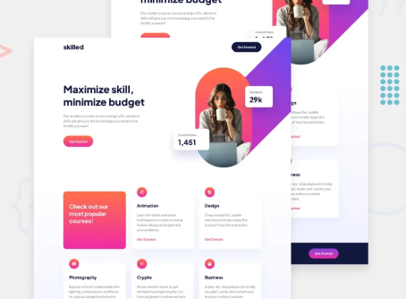

# Frontend Mentor - Skilled e-learning landing pagesolution

Yeyyy!!!! My first Frontend Mentor challenge is completed!!!!!
This is a solution to the [Skilled e-learning landing page challenge on Frontend Mentor](https://www.frontendmentor.io/challenges/skilled-elearning-landing-page-S1ObDrZ8q). Frontend Mentor challenges help you improve your coding skills by building realistic projects. 

## Table of contents

- [Overview](#overview)
  - [The challenge](#the-challenge)
  - [Screenshot](#screenshot)
  - [Links](#links)
- [My process](#my-process)
  - [Built with](#built-with)
  - [What I learned](#what-i-learned)
  - [Useful resources](#useful-resources)
- [Author](#author)

## Overview

### The challenge

Users should be able to:

- View the optimal layout depending on their device's screen size
- See hover and focus states for interactive elements

### Screenshot



### Links

- [Solution URL](https://www.frontendmentor.io/solutions/skilled-elearning-landing-page-using-html-and-scss-BzJoGQx5oK)
- [Live Site URL](https://rickhalmoguera.github.io/product_preview-card-component/)

## My process

### Built with

- Semantic HTML5 markup
- SCSS
- Flexbox
- Mobile-first workflow

### What I learned

Although it is a simple project, it helped me to learn the use of picture, which before I only used img. picture allows you to display different images in a responsive layout, without the need of Media Queries.

To see how you can add code snippets, see below:

```html
<picture>
    <source media="(min-width:1000px)" srcset="./assets/image-hero-desktop.png">
    <source media="(min-width: 501px)" srcset="./assets/image-hero-tablet.png">
    
</picture>
```

### Continued development

### Useful resources

- [HTML picture Tag](https://www.w3schools.com/tags/tag_picture.asp) - This helped my to discover the picture tag.
- [Flexbox playground](https://codepen.io/enxaneta/full/adLPwv/) - Amazing site to learn and try everything about Flexbox Layouts.

## Author

- Github - [Ricardo Halmoguera](https://github.com/RickHalmoguera)
- Frontend Mentor - [@RickHalmoguera](https://www.frontendmentor.io/profile/RickHalmoguera)


